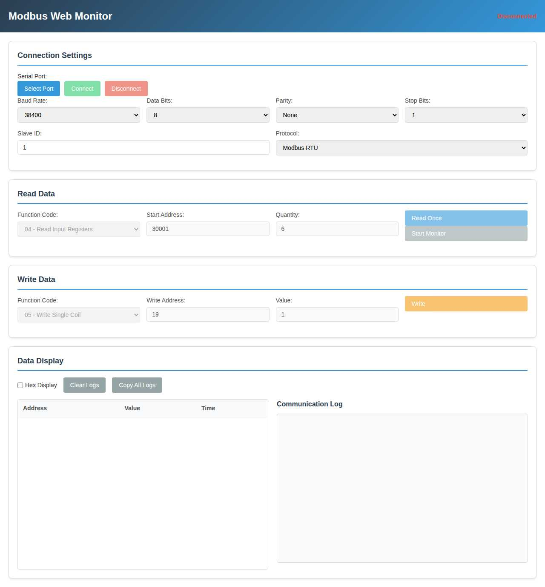
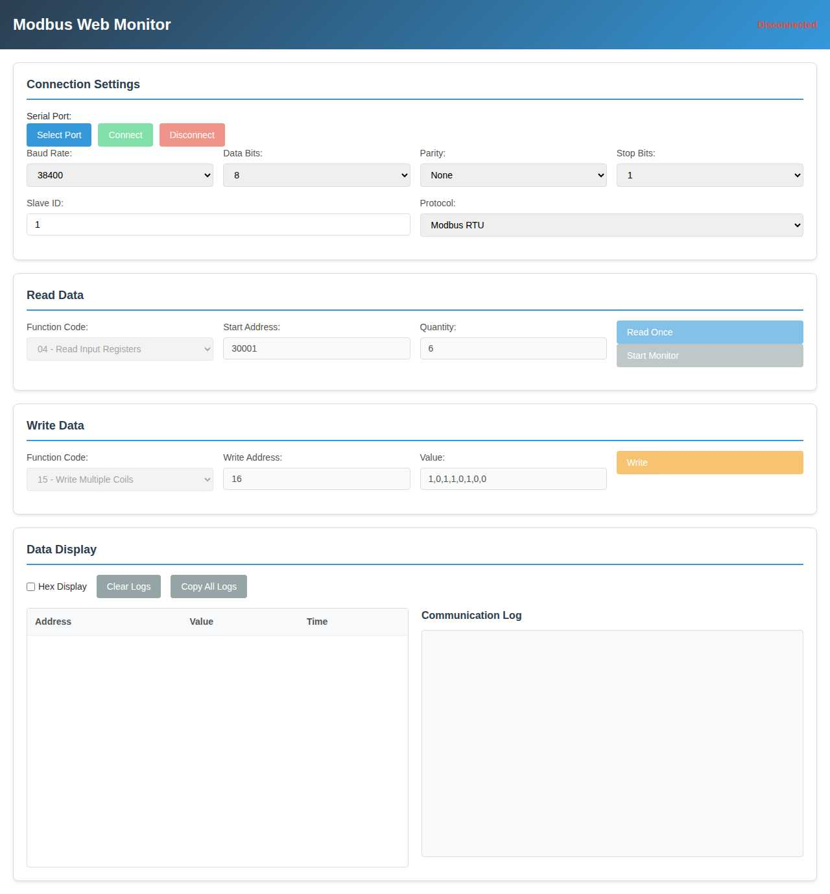
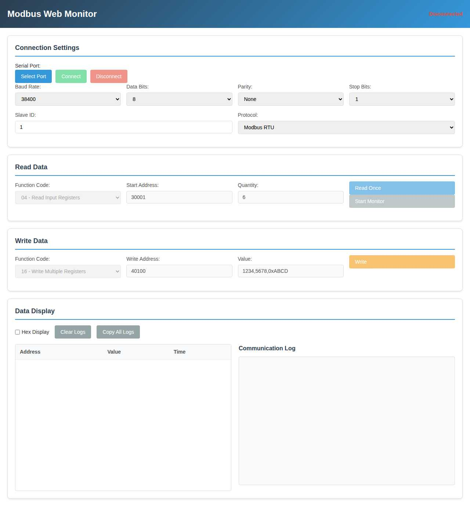

# Modbus Web Monitor

Web-based Modbus RTU / ASCII inspector (monitor & tester) powered by the Web Serial API and Preact. It lets you connect to a serial Modbus device directly from Chrome (or any Chromium browser supporting Web Serial), send read/write requests, monitor periodic polling, and inspect raw frames.

> This tool was originally prototyped in Japanese; all UI and source comments have been translated to English.

## Features

- Runs 100% in the browser (no native installs) using Web Serial API
- Supports Modbus RTU and ASCII protocols with full framing validation
- Single read (FC 01/02/03/04) & single write (FC 05/06) requests
- Periodic monitoring (polling) with adjustable interval in code (default 1000 ms)
- Hex or decimal display toggle for register values & addresses
- Real‑time communication log (TX/RX) with copy single / copy all and automatic trimming
- CRC16 (RTU) and LRC (ASCII) validation for frame integrity
- Simple buffering & response correlation with timeout handling
- Clean, responsive UI (desktop & mobile)

## Roadmap Ideas (Not yet implemented)

- Multi-coil (FC15) and multi-register (FC16) writes in UI
- Saving / loading session profiles
- Export logs / captured values to CSV
- Custom polling interval in UI
- Support for additional function codes & exception decoding table improvements

## Architecture Overview

| Layer | File(s) | Responsibility |
|-------|---------|---------------|
| UI (React-like) | `src/App.tsx` | Preact component implementation of the full UI (current active path) |
| Legacy DOM UI (non-Preact) | `src/ui.ts` + `src/main.ts` | Earlier vanilla DOM event driven UI (still present; not used when using `main.tsx`) |
| Modbus protocol | `src/modbus.ts` | Building requests, parsing RTU/ASCII responses, CRC/LRC validation, monitoring loop |
| Serial abstraction | `src/serial.ts` | Web Serial API wrapper + event emitter |
| Types | `src/types.ts` | Shared TypeScript interfaces |

The Preact entry point is `index.html` -> `src/main.tsx` -> `App`.

## Prerequisites

- Chromium-based browser with Web Serial API (Chrome 89+, Edge, etc.). Firefox & Safari currently lack required API.
- A Modbus slave device connected via a serial adapter recognizable by the OS (USB/RS485, etc.).

## Getting Started (Development)

Install dependencies (pnpm recommended):

```bash
pnpm install
pnpm dev
```

Then open the printed local URL (default `http://localhost:5173`).

For a production build:

```bash
pnpm build
pnpm preview
```

## Using the App

1. Open the app in a supported browser.
2. Click "Select Port" and choose your serial interface (RS-485 adapter, etc.).
3. Adjust serial parameters (baud rate, data bits, parity, stop bits) and Modbus settings (Slave ID, protocol) if needed.
4. Press "Connect".
5. For a single read: choose a function code (e.g. Holding Registers = FC03), start address, and quantity; click "Read".
6. To start periodic polling: click "Start Monitor" (click again to stop). Default interval is 1000 ms; adjust in `App.tsx` or `modbus.ts` if needed.
7. To write: select function (05 coil / 06 single register), address, and value (prefix with `0x` for hex) then click "Write".
8. Toggle "Hex Display" to view values / addresses in hexadecimal.
9. Use "Clear Logs" or "Copy All Logs" for log management; each log line also has an individual copy button.

### Log Types

- Info: general status messages
- Sent: outbound Modbus frame bytes
- Received: inbound Modbus frame bytes
- Error: serial / protocol / timeout issues

## Function Code Interface Screenshots

The following screenshots show the interface for each supported Modbus function code with realistic example data:

### Read Operations

#### FC01 - Read Coils
Interface for reading coil status (digital outputs). Example shows reading 8 coils starting at address 16.


#### FC02 - Read Discrete Inputs  
Interface for reading discrete input status (digital inputs). Example shows reading 12 inputs starting at address 100.


#### FC03 - Read Holding Registers
Interface for reading holding register values (read/write registers). Example shows reading 10 registers starting at address 40001.


#### FC04 - Read Input Registers
Interface for reading input register values (read-only registers). Example shows reading 6 registers starting at address 30001.


### Write Operations

#### FC05 - Write Single Coil
Interface for writing a single coil value. Example shows writing value 1 to address 19.



#### FC06 - Write Single Register
Interface for writing a single register value. Example shows writing hex value 0x1234 to address 40001.


#### FC15 - Write Multiple Coils
Interface for writing multiple coil values. Example shows writing bit pattern 1,0,1,1,0,1,0,0 starting at address 16.



#### FC16 - Write Multiple Registers
Interface for writing multiple register values. Example shows writing values 1234,5678,0xABCD starting at address 40100.



## Modbus Frames (RTU)

Read request (example FC03):

```
| Slave | Func | Start Hi | Start Lo | Qty Hi | Qty Lo | CRC Lo | CRC Hi |
```

Single register write (FC06):

```
| Slave | 06 | Addr Hi | Addr Lo | Value Hi | Value Lo | CRC Lo | CRC Hi |
```

CRC16 polynomial 0xA001 (LSB first) is used. Exception responses are decoded with a basic Japanese->English translated map.

## Modbus Frames (ASCII)

ASCII frames are encoded in hexadecimal text format with start/end delimiters:

```
:AABBCCDDDD...EELR\r\n
```

Where:
- `:` = Start character (0x3A)
- `AA`, `BB`, etc. = Hexadecimal pairs representing data bytes (uppercase)
- `LR` = LRC (Longitudinal Redundancy Check) as hex pair
- `\r\n` = Termination (CR+LF, 0x0D 0x0A)

**LRC Calculation:** `LRC = (256 - (sum of all data bytes % 256)) % 256`

Example read request (FC03):
```
:01030000000AFB\r\n
```
- Slave: 01, Function: 03, Start: 0000, Quantity: 000A, LRC: FB

The ASCII implementation handles:
- Proper frame detection (`:` start, `\r\n` end)
- Hex decoding with validation
- LRC calculation and verification  
- Buffer management for partial/concatenated frames
- Error handling identical to RTU (LRC mismatch triggers error event)

## Error / Exception Handling

- Pending request queue: only one outstanding at a time; attempts while busy reject.
- 3 second timeout clears pending state.
- On Modbus exception (function | 0x80), the code is mapped and surfaced in logs.
- CRC mismatch triggers an error and buffer reset for that frame.

## Security Notes

The Web Serial API requires a user gesture to open a port; the page cannot access serial devices silently. All communication happens locally; no data leaves the browser unless you manually copy it.

## Limitations

- Only a subset of function codes parsed for response data (01/02 bits, 03/04 registers, 05/06 write echo).
- No multi-write UI yet (15/16) though basic placeholders exist where appropriate.

## Project Scripts

| Script | Description |
|--------|-------------|
| `pnpm dev` | Start Vite dev server |
| `pnpm build` | Production build |
| `pnpm preview` | Preview built assets |
| `pnpm check` | Lint & TS (biome + tsgo) |
| `pnpm fix` | Auto-fix issues |

## Contributing

Issues & PRs welcome. Please keep the UI clean and lightweight. For significant protocol enhancements (multi-part frames, advanced diagnostics), consider adding tests and clear logs.

## License

MIT © 2025 takker99

## Acknowledgements

- Web Serial API team & MDN docs
- Preact for a minimal footprint
- Modbus protocol community references

---
Enjoy inspecting your Modbus devices directly from the browser.
